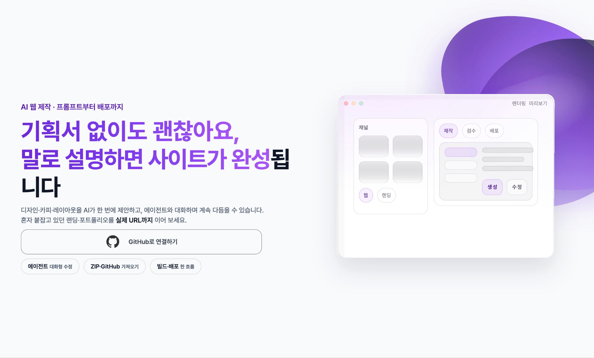

# Qeploy

> **AI Agent 기반 웹서비스 운영 자동화 플랫폼**  
> 자연어 요청만으로 웹 프로젝트를 생성·수정하고, 미리보기·버전관리·배포·도메인·클라우드 인프라 운영까지 연결합니다.

<br />

<p align="center">
  
</p>

<br />

## Product Vision

Qeploy는 단순한 AI 코드 생성 도구가 아니라, **웹 결과물이 실제 운영 가능한 서비스가 되기까지의 전체 흐름**을 연결하는 플랫폼입니다.

비개발자와 입문 개발자는 AI를 통해 웹사이트나 웹앱을 빠르게 만들 수 있지만, 실제 서비스화 단계에서는 GitHub, Docker, 배포, 도메인, DNS, HTTPS, AWS/GCP 인프라, 예상 비용, 운영 관리 같은 장벽을 만납니다.

Qeploy는 이 과정을 자연어와 Agent 구조로 단순화합니다.

```text
Idea → AI Agent → Docker Preview → GitHub Versioning → Deploy → Domain → Cloud Operation
```

---

## Repository

| Repository | Description |
| --- | --- |
| [Dvely_FE](https://github.com/Dvely/Dvely_FE) | Qeploy 프론트엔드. React 기반 사용자 화면, AI Workspace, 미리보기/상태 화면 연동 |
| [Dvely_springboot](https://github.com/Dvely/Dvely_springboot) | Qeploy 백엔드. Spring Boot 기반 API, 프로젝트/사용자/배포/도메인/Agent Workflow 처리 |
| [Dvely/.github](https://github.com/Dvely/.github) | GitHub Organization Profile README 및 발표자료 이미지 관리 |

---

## Demo Video

<a href="https://youtu.be/40x44EsGruY?si=SnJmcpMu_P3-9r0E">
  
</a>

- YouTube: https://youtu.be/40x44EsGruY?si=SnJmcpMu_P3-9r0E

---

## Problem

AI로 웹 초안을 만드는 것은 쉬워졌지만, 결과물을 실제 서비스로 운영하기까지의 과정은 여전히 복잡합니다.

사용자는 다음 단계에서 막힙니다.

- GitHub 레포, 브랜치, PR, merge, 버전관리 이해
- Docker, 빌드, 런타임 환경 구성
- GitHub Pages, AWS, GCP 등 배포 환경 선택과 설정
- 도메인, DNS, HTTPS 연결
- 클라우드 예상 비용 확인
- 배포 이후 서버 상태 확인, 로그 확인, 장애 대응, 재배포

Qeploy의 핵심 문제정의는 다음과 같습니다.

> **비개발자와 입문 개발자는 AI로 웹 결과물을 만들 수는 있지만, 이를 실제로 배포하고 운영 가능한 서비스로 만드는 과정에서 막힌다.**

---

## Product Scope

Qeploy는 PRD 기준으로 다음 전체 제품 범위를 지향합니다.

| Area | Scope |
| --- | --- |
| Project | 새 프로젝트 생성, ZIP 업로드, 기존 GitHub 레포 불러오기 |
| AI Workspace | 자연어 기반 생성·수정·배포·도메인·인프라 운영 요청 |
| Preview | Docker 컨테이너 기반 실제 실행 미리보기 |
| Version Control | preview 브랜치 작업 커밋, PR 생성, main/production merge, 버전 증가 |
| Deployment | GitHub Pages, 개인 AWS, 개인 GCP 배포 |
| Domain | qeploy.com 무료 서브도메인, 사용자 지정 커스텀 도메인, DNS/HTTPS 처리 |
| Cloud Infra | AWS/GCP 인프라 설정, 예상 요금 확인, 서버/인프라 운영 관리 |
| Operation | Overview 기반 상태 확인, 배포 이력, 최근 반영 이력, 운영 조치 진입 |
| Settings | Repository, Version Policy, Deployment Defaults, Domain, Cloud, Cost, Environment, Chat Approval 관리 |

---

## Core Features

### 1. GitHub 기반 프로젝트 시작

사용자는 GitHub 로그인 후 프로젝트를 시작합니다.

- 빈 프로젝트 생성
- ZIP 업로드
- 기존 GitHub 레포 불러오기
- 새 GitHub 레포 생성 및 연결
- 연결된 레포 기반 작업 이력 관리

### 2. AI Workspace

AI Workspace는 Qeploy의 핵심 작업 화면입니다.

사용자는 별도 액션 버튼을 찾지 않아도 자연어로 요청할 수 있습니다.

```text
카페 랜딩페이지를 만들고 cafe.qeploy.com으로 연결해줘.
헤더 크기를 줄이고 GitHub Pages로 배포해줘.
AWS로 배포하고 예상 비용이 3만원 이하가 되도록 설정해줘.
서버 상태 확인하고 문제가 있으면 원인을 알려줘.
```

### 3. Docker 기반 미리보기

Qeploy의 미리보기는 단순 정적 렌더링이 아니라 Docker 컨테이너 기반 실행 환경입니다.

- 실제 설치·빌드·실행 검증
- 클릭, 입력, 화면 이동 테스트
- 프로젝트 또는 작업 세션 단위 컨테이너 생성
- 미사용 컨테이너 자동 종료 및 정리
- 의존성/빌드/이미지 캐시 활용

### 4. 승인 기반 작업 반영

사용자에게 영향을 주는 작업은 승인 후 실행됩니다.

- 개발/수정 Approval
- 배포 Approval
- 도메인 연결 Approval
- 인프라 운영 Approval

승인창은 기술적 상세보다 사용자가 이해할 수 있는 **한 줄 요약 중심**으로 보여줍니다.

### 5. GitHub 기반 버전관리와 배포

코드 변경은 preview 브랜치에 요청 단위로 커밋되고, 배포 시점에 PR 생성 및 main/production merge가 진행됩니다.

```text
자연어 요청
→ Agent 처리
→ preview 브랜치 커밋
→ Docker 미리보기
→ 사용자 승인
→ PR 생성
→ main/production merge
→ 버전 증가
→ 배포 workflow 실행
```

### 6. 도메인 연결

Qeploy는 배포 후 접근 가능한 URL을 제공합니다.

- 배포 환경 기본 URL
- qeploy.com 무료 서브도메인
- 사용자 지정 커스텀 도메인
- DNS 설정 확인
- HTTPS 처리
- 도메인 연결 검증

### 7. 클라우드 인프라 운영

AWS/GCP 배포는 배포에서 끝나지 않습니다. Qeploy는 배포 이후 운영까지 자연어로 관리하는 것을 목표로 합니다.

- 서버 상태 확인
- 로그 확인
- 장애 원인 분석
- 서버 재시작
- 리소스 조정
- 비용 최적화 제안
- 불필요 리소스 정리

---

## Agent Architecture

Qeploy는 하나의 Agent가 모든 작업을 처리하는 구조가 아니라, **의사결정 Agent가 요청을 해석한 뒤 전문 Agent로 라우팅하는 구조**를 사용합니다.

| Agent | Role |
| --- | --- |
| Decision Agent | 자연어 요청 해석, 맥락 이해, 프로젝트 상태 반영, 작업 의도 분류 |
| Code Agent | 프로젝트 생성, 코드 수정, UI 변경, 오류 수정, 빌드 실패 원인 분석 |
| Deploy Agent | GitHub Pages / AWS / GCP 배포, workflow 실행, 배포 실패 원인 분석 |
| Domain Agent | qeploy.com 서브도메인, 커스텀 도메인, DNS, HTTPS 처리 |
| Infra Agent | AWS/GCP 서버 상태 확인, 로그 확인, 리소스 조정, 비용 최적화 |

```text
User Natural Language
        ↓
Decision Agent
        ↓
Request Classification
 ┌──────────────┬──────────────┬──────────────┬──────────────┐
 │ Code Agent   │ Deploy Agent │ Domain Agent │ Infra Agent  │
 └──────────────┴──────────────┴──────────────┴──────────────┘
        ↓
Approval → Execution → Log / Result
```

---

## Main Screens

Qeploy의 핵심 화면은 다음 4개 축으로 구성됩니다.

| Screen | Description |
| --- | --- |
| Projects | 프로젝트 목록, 새 프로젝트 생성, ZIP 업로드, GitHub 레포 불러오기 |
| Overview | 현재 URL, 배포 상태, 현재 버전, 최근 반영 이력, 운영 조치 진입점 |
| AI Workspace | Docker 미리보기, AI 대화, 자연어 입력, 승인 상태, diff, 오류 패널 |
| Project Settings | 레포, 버전 정책, 배포 기본값, 도메인, 클라우드, 비용, 환경값, Chat 승인 정책 |

---

## Tech Stack

| Layer | Stack |
| --- | --- |
| Frontend | React, Vite, Axios |
| Backend | Spring Boot, JPA, REST API |
| Database | MySQL |
| Preview / Runtime | Docker |
| DevOps | GitHub Actions, Nginx, PM2 |
| Integration | GitHub API, Cloudflare API, Anthropic/OpenAI LLM API |
| Infrastructure | AWS EC2, AWS/GCP 확장 고려 |
| Collaboration | Figma, Notion, GitHub |

---

## Success Metrics

Qeploy의 성공은 단순히 AI가 코드를 생성하는지가 아니라, 사용자의 웹서비스가 실제 운영 가능한 상태까지 도달했는지로 판단합니다.

| Metric | Meaning |
| --- | --- |
| Docker Preview Success Rate | 요청 결과가 컨테이너에서 정상 설치·빌드·실행되는 비율 |
| Deployment Success Rate | 승인 후 GitHub Pages / AWS / GCP 배포가 정상 완료되는 비율 |
| Build Failure Resolution Rate | 빌드 실패 발생 시 원인 분석과 수정 제안으로 해결되는 비율 |
| Request Classification Accuracy | 자연어 요청이 코드/배포/도메인/인프라 작업으로 정확히 분류되는 비율 |
| Domain Connection Success Rate | qeploy.com 서브도메인 또는 커스텀 도메인이 정상 연결되는 비율 |
| Cost Estimate Reliability | AWS/GCP 예상 요금이 실제 비용과 얼마나 근접한지 |

---

## UX Principles

- **복잡성 숨기기**: GitHub, Docker, DNS, AWS/GCP 개념을 사용자가 직접 이해하지 않아도 되게 한다.
- **자연어 우선**: 사용자는 원하는 결과를 말하고, 시스템은 Agent workflow로 처리한다.
- **미리보기 우선**: 실제 반영 전 Docker 기반 미리보기에서 동작 결과를 확인한다.
- **승인 기반 통제**: 서비스 영향이 있는 작업은 승인 후 실행한다.
- **한 줄 요약 중심**: 승인창과 상태 정보는 사용자가 이해 가능한 요약 중심으로 제공한다.
- **결과 중심 정보 제공**: 미리보기 결과, 승인 요약, 배포 URL, 현재 버전, 예상 비용을 우선 노출한다.

---

## Presentation Materials

발표자료 이미지는 서비스 소개 화면으로 사용하지 않고, 프로젝트 산출물 보관용으로 분리합니다.

- 중간발표: 1학기 중간 프로젝트 제안서 발표
- 최종발표: 1학기 기말 프로젝트 최종 발표
- 발표자료 원본 파일 권장 경로
  - `./docs/midterm-presentation.pdf`
  - `./docs/final-presentation.pdf`
  - `./docs/midterm-presentation.pptx`
  - `./docs/final-presentation.pptx`

<details>
<summary>발표자료 이미지 보기</summary>

| 중간발표 | 최종발표 |
| --- | --- |
| <strong>01. 표지</strong><br> | <strong>01. 표지</strong><br> |
| <strong>02. 개요</strong><br> | <strong>02. 문제정의</strong><br> |
| <strong>03. 시스템 구성 및 동작</strong><br> | <strong>03. 시장조사 · 경쟁사분석</strong><br> |
| <strong>04. 시스템 구성도</strong><br> | <strong>04. 기획의도 · 기대효과 · 최종목표</strong><br> |
| <strong>05. 개발환경</strong><br> | <strong>05. 서비스소개 · 진행도</strong><br> |
| <strong>06. 유사시스템 조사</strong><br> | <strong>06. System Architecture</strong><br> |
| <strong>07. 기술탐구</strong><br> | <strong>07. Agentic Workflow</strong><br> |
| <strong>08. 화면 UI · 기능 목록</strong><br> | <strong>08. 시연영상</strong><br> |
| <strong>09. 일정계획</strong><br> | <strong>09. 트러블슈팅 · diff API 낭비</strong><br> |
| <strong>10. 기타</strong><br> | <strong>10. 트러블슈팅 · chat 생성 방식</strong><br> |
| — | <strong>11. 트러블슈팅 · Agent 로그 스트리밍</strong><br> |
| — | <strong>12. 트러블슈팅 · base path / custom domain</strong><br> |
| — | <strong>13. 트러블슈팅 · Human Error</strong><br> |
| — | <strong>14. 팀 역할 및 소개</strong><br> |
| — | <strong>15. 일정 및 계획</strong><br> |

</details>

---

## Team

| Name | Role | Responsibility |
| --- | --- | --- |
| 김인성 | PM / Backend | 서비스 기획, 요구사항 정리, 기능 우선순위 관리, Project · Chat · DomainBinding · CloudConnection 모듈 개발 |
| 이운학 | Infra / Backend | 인프라 세팅, Auth · User · Deployment 모듈 개발, Agentic Workflow 설계 및 개발 |
| 문채현 | Frontend | 프론트 정책 설정, API 연동, 미리보기 및 상태 화면 연동 |
| 김태우 | Design / Frontend | 서비스 화면 구조 설계, Figma 디자인, 퍼블리싱 |

---

## Roadmap

| Phase | Focus |
| --- | --- |
| 1차 구현 | 자연어 수정, GitHub 레포 연동, GitHub Pages 배포, 도메인 연결 흐름 구현 |
| 안정화 | Agent 실행 안정성, 배포 실패 복구, diff 최적화, 로그 스트리밍 개선 |
| 확장 | AWS/GCP 클라우드 인프라 관리, 비용 예측, 서버 상태 확인 및 운영 수정 기능 구체화 |
| 검증 | 사용자 테스트, 예외 처리, 보안 검증, 운영 안정성 개선 |

---

## Final Summary

Qeploy는 비개발자와 입문 개발자가 AI Agent와 자연어로 웹 프로젝트를 생성·수정하고, Docker 기반 미리보기에서 실제 동작을 검증한 뒤, GitHub 기반 이력/버전 관리를 거쳐 GitHub Pages 또는 개인 AWS/GCP 같은 배포 환경에 배포하고, qeploy.com 서브도메인 또는 사용자 지정 도메인까지 연결할 수 있게 하는 **AI Agent 기반 웹서비스 운영 자동화 플랫폼**입니다.

Qeploy의 핵심은 단순 코드 생성이 아니라, 웹서비스가 실제 운영 가능한 상태에 도달하기까지 필요한 개발, 검증, 버전관리, 배포, 도메인, 인프라 설정, 운영 관리를 하나의 자연어 기반 흐름으로 연결하는 것입니다.
